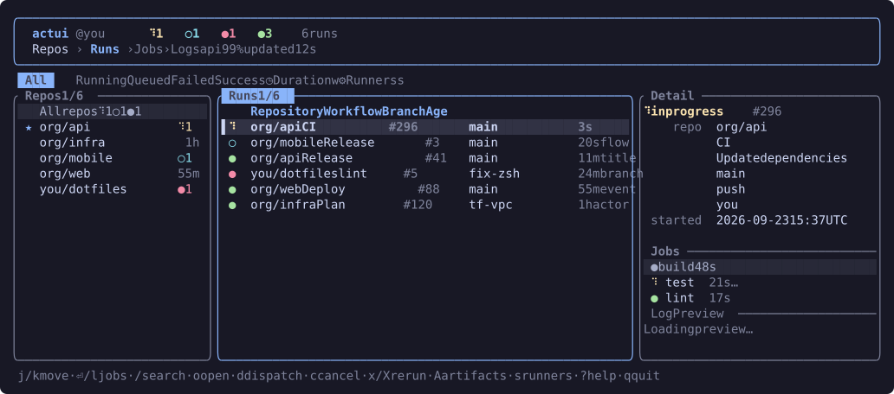

# actui

A terminal UI for GitHub Actions across all the repos and orgs your account can see.



## Features

- Recent runs from all your repos in one list, most recent activity first.
- A repos sidebar: pin repos to the top, limit the list to one repo (which also
  reads further back, 100 runs), and dispatch in repos with no recent runs.
- Each run's jobs, and the steps of a running job as they happen. Full logs load
  when the job finishes.
- A logs viewer with foldable steps, search, a view of just the lines near
  errors, and saving to a file.
- Failure annotations (`v`): the `file:line` errors of a run's failed jobs, each
  one opening its job's log at that line.
- A duration chart (`w`) of a workflow's successful runs, with the median and
  whether it is getting slower.
- The tag or release a run made, shown with the run.
- Dispatch a workflow with a form built from its inputs, cancel and re-run runs
  or jobs, approve held runs, and download artifacts.
- Your orgs' self-hosted runners (`s`).
- A desktop notification and terminal bell when a run finishes.
- Light and dark themes, following the terminal's background.
- Pane and column widths you drag stay set between sessions.
- Light on the API: conditional requests (a `304` doesn't count against the rate
  limit), fast polling only while runs are active, and a pause when GitHub
  rate-limits.

## Install

Prebuilt binaries for macOS, Linux and Windows are on the
[releases page](https://github.com/shamilatesoglu/actui/releases). Or with Cargo:

```sh
cargo binstall actui   # fetches the prebuilt binary
cargo install actui    # builds from source
```

## Auth

actui uses the first of:

1. `$GITHUB_TOKEN` or `$GH_TOKEN`
2. `gh auth token` (from the [GitHub CLI](https://cli.github.com/), after `gh auth login`)

The token needs the `repo` and `workflow` scopes.

## Configuration

Optional, in `~/.config/actui/config.toml`, or under `$XDG_CONFIG_HOME` if you set it
(Windows: `%APPDATA%\actui\config.toml`). `actui --help` prints the path it reads.
The defaults:

```toml
refresh_secs        = 60      # how often to read every repo's runs
active_refresh_secs = 15      # how often to read active runs' jobs
live_refresh_secs   = 2       # how often the live steps view updates (1-10)
runs_per_repo       = 15      # runs read per repo
scoped_runs         = 100     # runs read for the repo the sidebar is on (max 100)
concurrency         = 10      # repos read at once
max_repos           = 60      # most recently pushed repos to watch (0 = all)
skip_archived       = true
notify              = true    # desktop notification when a run finishes
bell                = true    # terminal bell when a run finishes
theme               = "auto"  # or "dark" / "light"
sidebar             = true    # show the repos sidebar
sort                = "alpha" # sidebar order after pinned repos, or "used"
pinned              = []      # e.g. ["my-org/api"]
include             = []      # only repos whose name contains one of these
exclude             = []      # skip repos whose name contains one of these
```

If you are in large orgs, set `include` or lower `max_repos` to stay under
GitHub's 5000 requests an hour.

Pane widths and the history behind `sort = "used"` are saved in `state.toml`
next to the config.

## Keys

| Key | Action |
|-----|--------|
| `j` / `k` | move |
| `Tab`, `←` / `→` | move between the Repos, Runs and Jobs panes |
| `Enter` | open a run's jobs, or a job's logs |
| `1`–`5`, `/` | filter by status, search |
| `d` | dispatch a workflow |
| `c`, `x` / `X` | cancel, re-run failed jobs / all jobs |
| `o` | open on github.com |
| `?` | all keys |
| `q` | quit |

The mouse works too: click to select, scroll, and drag pane borders and column
edges to resize.

## License

MIT, see [LICENSE](LICENSE).
